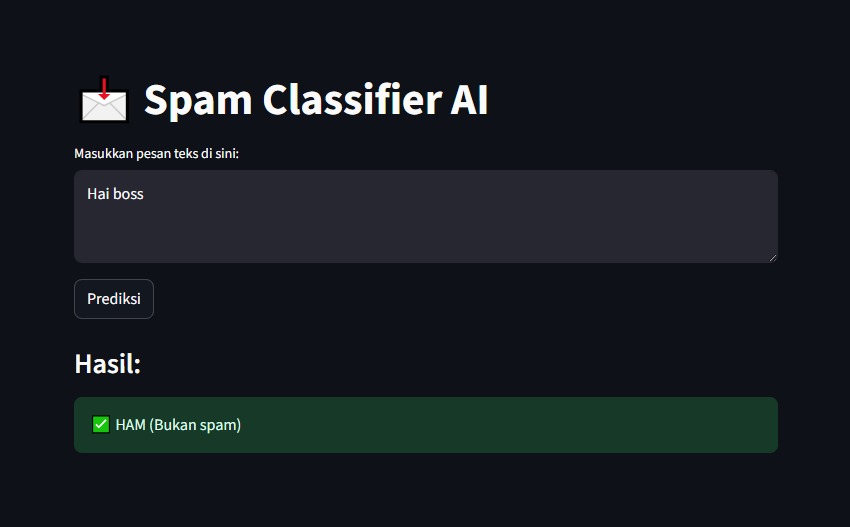

# 📧 Spam Classifier App

A simple machine learning web app to classify spam messages using Streamlit.

## 📚 Project Overview

This project is a machine learning model built to classify text messages as either **Spam** or **Not Spam**. The app is deployed using **Streamlit Cloud**, providing an easy and interactive web interface for users to test messages in real-time.

## 📸 App Screenshot


## 🚀 Features

- 📊 Load and process text message dataset
- 📝 Preprocess text using `nltk` (Natural Language Toolkit)
- 🎛️ Train a classifier using `scikit-learn`
- 💾 Save and load the trained model using `joblib`
- 🌐 Deploy a Streamlit web app for live prediction

## 🛠️ Tech Stack

- Python 3.x
- Pandas
- Numpy
- NLTK
- Scikit-learn
- Joblib
- Streamlit

## 📦 Installation

1. Clone the repository:
   ```bash
   git clone https://github.com/yourusername/spam-classifier-app.git
   cd spam-classifier-app
2. Create Virtual Environment
    python -m venv env
    env\Scripts\activate    # Windows
    source env/bin/activate # MacOS/Linux
3. Install Dependencies
   pip install -r requirements.txt
4. Run the Streamlit App
   streamlit run app.py

## 📑 Dataset
The dataset used in this project:
spam.csv from Kaggle

📖 How to Use
Input a message in the text field

Click Predict
The app will classify your message as Spam or Not Spam

✨ Credit
Built with ❤️ by Nistayle
